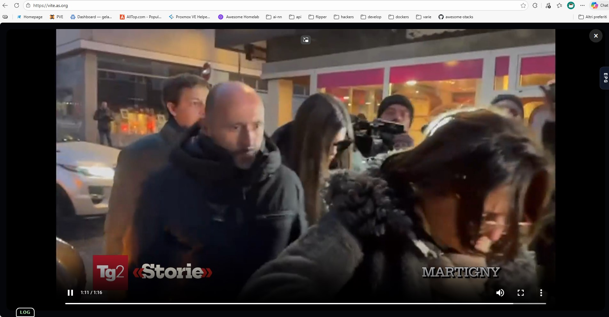
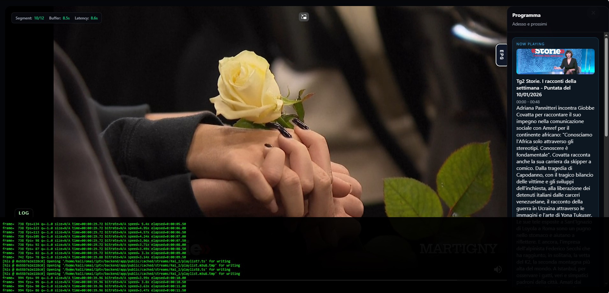
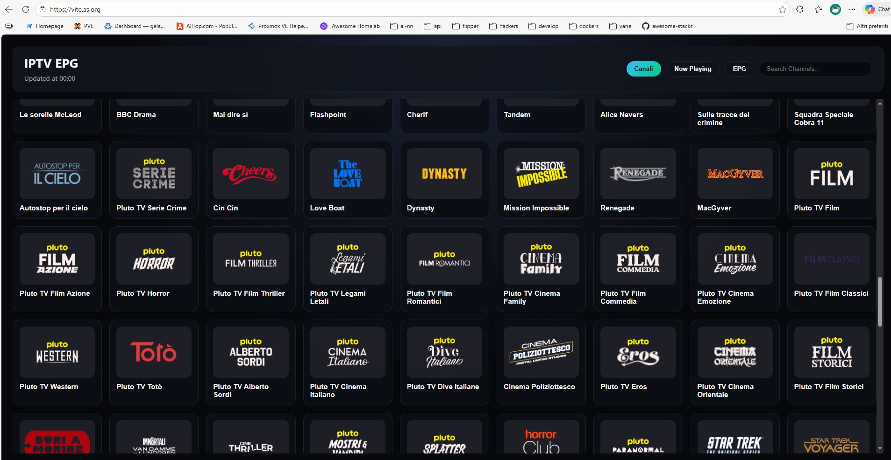
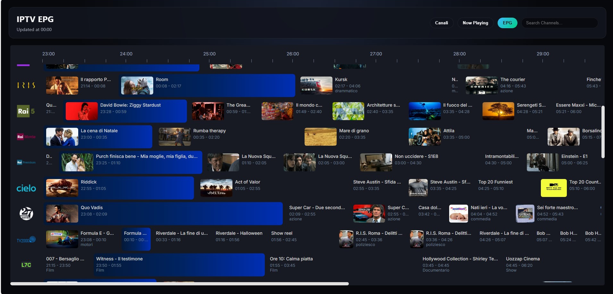
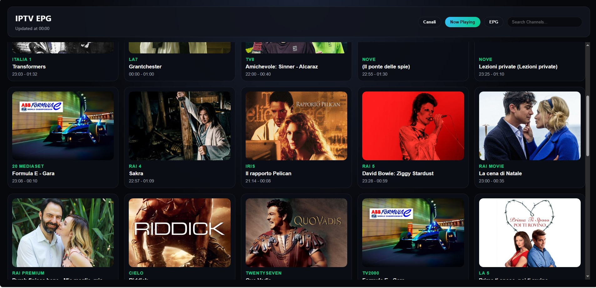

# LightIPTV - Web IPTV Viewer

A lightweight web IPTV viewer for direct M3U + XMLTV sources, perfect for testing playlists or light browser-based viewing.

## ⚠️ Important Note

**This is not a full-featured IPTV client** but rather a testing/light viewing tool. It uses minimal infrastructure to stream IPTV channels via web browser. Ideal for debugging, quick tests, or occasional use.

## 🔧 Configuration

The app is configured via `backend/app/config/config.yml`. This file defines:
- M3U sources and max connections
- XMLTV sources
- Channel tabs/groups and matching rules

## 🐳 Docker Hub

Image available on Docker Hub: **`astevani/lightiptv:latest`** (amd64)

## 📦 Docker Compose

### docker-compose.yml

```yaml
services:
  lightiptv:
    image: astevani/lightiptv:latest
    container_name: lightiptv
    restart: unless-stopped
    ports:
      - "3005:3005"
    volumes:
      - ./data:/app/app/data
      - ./cache:/app/app/public/cached
      - ./backend/app/config/config.yml:/app/app/config/config.yml
```

### Environment Variables

#### Optional
- **`ADDRESS`**: bind address (default: `0.0.0.0`)
- **`PORT`**: LightIPTV server port (default: `3005`)
- **`MAX_STREAMS`**: Maximum concurrent active streams (default: `2`, use `0` for unlimited)
- **`LOCALE`**: locale for time formatting (default: `it-IT`)
- **`EPG_CACHE_DURATION`**: cache duration in ms (default: `3600000`)
- **`STREAM_CLEANUP_INTERVAL`**: cleanup interval in ms (default: `30000`)
- **`STREAM_INACTIVITY_TIMEOUT`**: inactivity timeout in ms (default: `10000`)
- **`TUNER_RELEASE_TIMEOUT`**: tuner release timeout in ms (default: `15000`)
- **`STREAMLINK_USER_AGENT`**: user-agent for Streamlink
- **`FFMPEG_HLS_TIME`**, **`FFMPEG_HLS_LIST_SIZE`**, **`FFMPEG_PRESET`**, **`FFMPEG_FRAMERATE`**, **`FFMPEG_GOP_SIZE`**, **`FFMPEG_AUDIO_BITRATE`**

#### Example Configuration

```yaml
environment:
  - PORT=3005
  - MAX_STREAMS=2
```

### Volumes

- **`./data:/app/app/data`**: Persisted app data (channels, logs, etc.)
- **`./cache:/app/app/public/cached`**: Cached assets and HLS segments
- **`./backend/app/config/config.yml:/app/app/config/config.yml`**: App configuration

## 🧩 Config file (config.yml)

The configuration is defined in `backend/app/config/config.yml`.

```yaml
m3u:
  max-connections: 10
  sources:
    iptv_org_italiano:
      description: "IPTV Org Italiano"
      url: https://iptv-org.github.io/iptv/languages/ita.m3u
      active: true

xmltv:
  sources:
    it_dttsat_full:
      description: "DTT SAT Italia Full EPG"
      url: http://116.202.210.205/test/it_dttsat_full.xml
      active: true

tabs:
  Italia:
    include:
      - match: Rai 1
        tvgNo: 1
```

Notes:
- Set `active: true/false` to enable or disable a source.
- `tabs` lets you group channels using `match` (string or `/regex/`) and optional properties like `tvgNo`, `logo`, `group`.
- `groups` and `sources` blocks can include/exclude by group/source name.

### 🛠 Customizing FFmpeg Transcoding

You can override the FFmpeg pipeline by mounting your own `ffmpeg-profile.js` in the container.

Create a file named `ffmpeg-profile.js` locally and use this template (updated to the current default profile):

```javascript
const CONFIG = require('../config');

module.exports = function (filename, streamUrl) {
  return [
    '-user_agent', 'LightIPTV',
    '-fflags', '+genpts',
    '-avoid_negative_ts', 'make_zero',
    '-i', streamUrl,
    '-map', '0:v?',
    '-map', '0:a?',
    '-c:v', 'copy',
    '-c:a', 'aac',
    '-b:a', '96k',
    '-ar', '48000',
    '-ac', '2',
    '-f', 'hls',
    '-hls_time', CONFIG.FFMPEG.HLS_TIME.toString(),
    '-hls_list_size', CONFIG.FFMPEG.HLS_LIST_SIZE.toString(),
    '-hls_segment_type', 'mpegts',
    '-hls_flags', 'delete_segments+independent_segments',
    '-hls_playlist_type', 'event',
    filename
  ];
};
```

Mount this file into the container via `docker-compose.yml`:

```yaml
volumes:
  - ./data:/app/app/data
  - ./cache:/app/app/public/cached
  - ./my-ffmpeg-profile.js:/app/app/services/ffmpeg-profile.js # Custom FFmpeg profile (production)
```

## 🚀 Getting Started

```bash
# Build and start
docker-compose up -d

# View logs
docker-compose logs -f lightiptv

# Stop
docker-compose down
```

## 🌐 Access

Open browser: `http://localhost:3005`

## 🎛 Frontend (Vite + React)

The frontend lives in `frontend/` and uses Planby for the EPG grid. In production the Vite build is emitted into `backend/app/public/dist` and served by the backend automatically.

```bash
cd frontend
npm install
npm run build
```


## 📸 Screenshots

### Main Interface


### Debug Mode (Press H)


### Channels


### EPG


### Now Playing


## 🔍 Debug with H key

Press **`H`** key to show/hide real-time FFmpeg log.

**Log utility:**
- View executed FFmpeg command
- Monitor bitrate, frame rate, encoding speed
- Diagnose stream connection issues
- Verify network errors or unsupported codecs

The log updates in real-time during stream preparation and remains available during playback.

## ⌨️ Keyboard shortcuts

- **`H`**: toggle FFmpeg log overlay
- **`D`**: toggle stream debug (segments + latency)

## 📝 Technical Notes

- **Base image**: `node:20-alpine` (~150MB final with FFmpeg)
- **FFmpeg**: HLS transcoding with 4-second segments
- **Stream sharing**: Reuses same FFmpeg process for identical URLs
- **Stream limit**: Configurable max concurrent streams (default: 2)
- **Auto-cleanup**: Inactive streams terminated after 60 seconds
- **EPG cache**: 1-hour cache duration to reduce upstream calls

## 🎯 Recommended Use Cases

- Quick IPTV playlist testing
- Debugging problematic streams (with FFmpeg log)
- Occasional browser viewing
- Development/staging environment

## ✅ Tested With

**Italian TV Channels:**
- **M3U Playlist**: [greenarw/tv_italia.m3u](https://gist.github.com/greenarw/efa4568ed2fa2e53a1aec9073d027243)
  - Direct link: `https://gist.githubusercontent.com/greenarw/efa4568ed2fa2e53a1aec9073d027243/raw/7a50a2c1643d1548971928aebdd9e906a2043b9f/tv_italia.m3u`
- **EPG (DTT & SAT)**: [sfiorini/IPTV-Italy](https://github.com/sfiorini/IPTV-Italy)
  - Direct link: `http://116.202.210.205/test/it_dttsat_full.xml`

Successfully tested with Italian digital terrestrial and satellite channels.

**Not recommended for:** heavy usage, production with many simultaneous users, 24/7 streaming.
