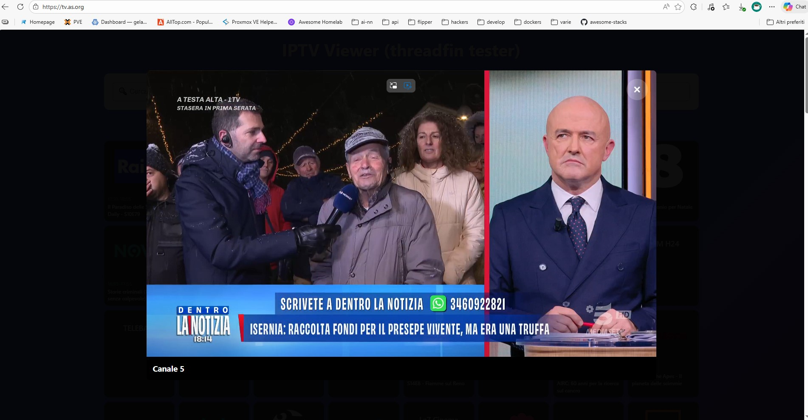
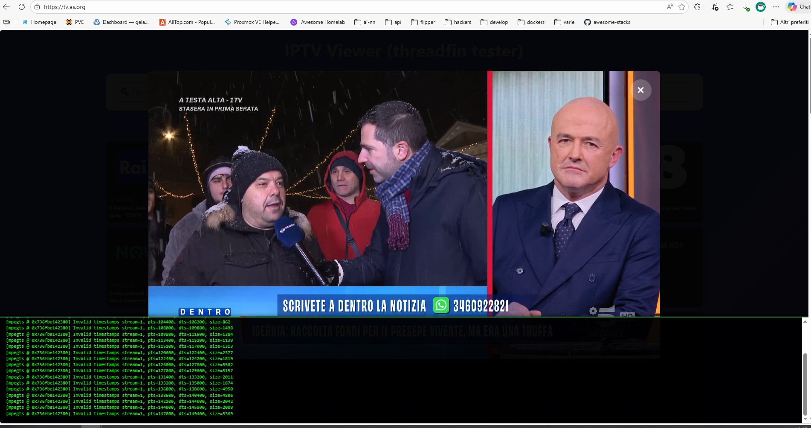

# LightIPTV - Web IPTV Viewer

A lightweight web IPTV viewer designed to work in cascade with **Threadfin**, perfect for testing playlists or light browser-based viewing.

## ⚠️ Important Note

**This is not a full-featured IPTV client** but rather a testing/light viewing tool. It uses minimal infrastructure to stream IPTV channels via web browser. Ideal for debugging, quick tests, or occasional use.

## 🔧 Requirements: Threadfin

LightIPTV works **in cascade with Threadfin**, which handles:
- Managing the original M3U playlist
- Buffering streams (recommended: 0.5MB in Threadfin)
- Providing EPG via XMLTV with associated channels

**Threadfin tested and working** with these settings.

## 🐳 Docker Hub

Image available on Docker Hub: **`astevani/lightiptv:latest`** (amd64)

## 📦 Complete Setup with Threadfin

### docker-compose.yml

```yaml
networks:
  tvstack:
    driver: bridge

services:
  threadfin:
    image: fyb3roptik/threadfin
    container_name: threadfin
    hostname: threadfin
    restart: unless-stopped
    ports:
      - "34400:34400"
    environment:
      - PUID=1000
      - PGID=1000
      - TZ=Europe/Rome
    volumes:
      - ./threadfin/conf:/home/threadfin/conf
      - ./threadfin/temp:/tmp/threadfin:rw
    networks:
      - tvstack

  lightiptv:
    image: astevani/lightiptv:latest
    container_name: lightiptv
    restart: unless-stopped
    ports:
      - "3005:3005"
    environment:
      # Internal URLs to Threadfin (same Docker network)
      - THREADFIN_M3U_URL=http://threadfin:34400/m3u/threadfin.m3u
      - THREADFIN_XMLTV_URL=http://threadfin:34400/xmltv/threadfin.xml
      - PORT=3005
    volumes:
      - ./lightiptv/streams:/app/app/public/streams
    networks:
      - tvstack
    depends_on:
      - threadfin
```

### Environment Variables

#### Required
- **`THREADFIN_M3U_URL`**: URL of Threadfin's M3U playlist (can be internal Docker URL)
- **`THREADFIN_XMLTV_URL`**: URL of Threadfin's XMLTV EPG (can be internal Docker URL)

#### Optional
- **`PORT`**: LightIPTV server port (default: `3005`)
- **`MAX_STREAMS`**: Maximum concurrent active streams (default: `2`, use `0` for unlimited)

#### Example Configuration

```yaml
environment:
  - THREADFIN_M3U_URL=http://threadfin:34400/m3u/threadfin.m3u
  - THREADFIN_XMLTV_URL=http://threadfin:34400/xmltv/threadfin.xml
  - PORT=3005
  - MAX_STREAMS=2
```

### Volumes

- **`./lightiptv/streams:/app/app/public/streams`**: External directory for HLS stream segments (avoids writing to container image)

### 🛠 Customizing FFmpeg Transcoding

You can fully customize the FFmpeg transcoding parameters by mounting your own configuration file. This allows you to tune performance, change codecs (e.g., use hardware acceleration), or adjust quality without rebuilding the image.

1. Create a file named `ffmpeg-profile.js` locally.
2. Use the following template and adjust the arguments as needed:

```javascript
const path = require('path');
// You can require the config if needed, or just hardcode values
// const CONFIG = require('../config');

module.exports = function(streamUrl, streamDir) {
  return [
    '-fflags', '+genpts+igndts', // Required flags
    '-f', 'mpegts',
    '-i', streamUrl,
    '-map', '0:v?',
    '-map', '0:a?',
    // --- Customization Area ---
    '-c:v', 'libx264',           // Video Codec (e.g., h264_nvenc for NVIDIA)
    '-preset', 'veryfast',       // Preset
    '-tune', 'zerolatency',
    '-r', '25',                  // Framerate
    '-g', '50',                  // GOP Size
    '-c:a', 'aac',               // Audio Codec
    '-b:a', '128k',              // Audio Bitrate
    // -------------------------
    '-f', 'hls',
    '-hls_time', '4',
    '-hls_list_size', '8',
    '-hls_flags', 'delete_segments+append_list',
    path.join(streamDir, 'playlist.m3u8') // The output path is mandatory
  ];
};
```

3. Mount this file into the container via `docker-compose.yml`:

```yaml
volumes:
  - ./lightiptv/streams:/app/app/public/streams
  - ./my-ffmpeg-profile.js:/app/app/services/ffmpeg-profile.js # Mount custom profile
```

## 🚀 Getting Started

```bash
# Build and start
docker-compose up -d

# View logs
docker-compose logs -f lightiptv

# Stop
docker-compose down
```

## 🌐 Access

Open browser: `http://localhost:3005`


## 📸 Screenshots

### Main Interface


### Debug Mode (Press H)


## 🔍 Debug with H key

Press **`H`** key to show/hide real-time FFmpeg log.

**Log utility:**
- View executed FFmpeg command
- Monitor bitrate, frame rate, encoding speed
- Diagnose stream connection issues
- Verify network errors or unsupported codecs

The log updates in real-time during stream preparation and remains available during playback.

## 📝 Technical Notes

- **Base image**: `node:20-alpine` (~150MB final with FFmpeg)
- **FFmpeg**: HLS transcoding with 4-second segments
- **Stream sharing**: Reuses same FFmpeg process for identical URLs
- **Stream limit**: Configurable max concurrent streams (default: 2)
- **Auto-cleanup**: Inactive streams terminated after 60 seconds
- **EPG cache**: 1-hour cache duration to reduce Threadfin calls

## 🎯 Recommended Use Cases

- Quick IPTV playlist testing
- Debugging problematic streams (with FFmpeg log)
- Occasional browser viewing
- Development/staging environment

## ✅ Tested With

**Italian TV Channels:**
- **M3U Playlist**: [greenarw/tv_italia.m3u](https://gist.github.com/greenarw/efa4568ed2fa2e53a1aec9073d027243)
  - Direct link: `https://gist.githubusercontent.com/greenarw/efa4568ed2fa2e53a1aec9073d027243/raw/7a50a2c1643d1548971928aebdd9e906a2043b9f/tv_italia.m3u`
- **EPG (DTT & SAT)**: [sfiorini/IPTV-Italy](https://github.com/sfiorini/IPTV-Italy)
  - Direct link: `http://116.202.210.205/test/it_dttsat_full.xml`

Successfully tested with Italian digital terrestrial and satellite channels.

**Not recommended for:** heavy usage, production with many simultaneous users, 24/7 streaming.
